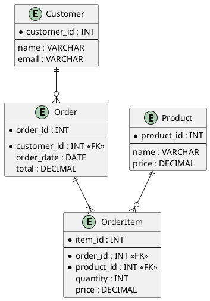

# Entity-Relationship Diagram Examples

## Overview

Entity-Relationship Diagrams (ERDs) are visual representations of database structures showing entities, their attributes, and relationships. This guide provides comprehensive examples using various notation styles.

---

## Table of Contents

1. [ERD Notation Styles](#erd-notation-styles)
2. [Basic ERD Elements](#basic-erd-elements)
3. [Simple Examples](#simple-examples)
4. [Complex Examples](#complex-examples)
5. [Notation Comparison](#notation-comparison)
6. [Best Practices](#best-practices)

---

## ERD Notation Styles

### Three Main Notation Styles

1. **Chen Notation** - Original ERD style (diamonds for relationships)
2. **Crow's Foot (Martin/IE)** - Most popular (uses lines with symbols)
3. **UML Class Diagram** - Object-oriented approach

---

## Basic ERD Elements

### Entities

Entities represent tables in the database.

**Chen Notation:**
```
┌─────────────┐
│   Customer  │  (Rectangle)
└─────────────┘
```

**Crow's Foot:**
```
┌─────────────┐
│  Customer   │
├─────────────┤
│ customer_id │
│ name        │
│ email       │
└─────────────┘
```

### Attributes

Attributes are properties of entities (columns in tables).

**Chen Notation:**
```
     ┌─────────┐
     │customer │
     │   id    │
     └────┬────┘
          │
     ┌────┴─────┐
     │          │
  ┌──┴───┐  ┌──┴───┐
  │ name │  │email │
  └──────┘  └──────┘
```

**Crow's Foot** (attributes listed in entity box)

### Relationships

Connections between entities.

**Chen Notation:**
```
┌─────────┐       ◇◇◇◇◇◇       ┌─────────┐
│Customer │───────places───────│  Order  │
└─────────┘                    └─────────┘
```

**Crow's Foot:**
```
┌─────────┐                    ┌─────────┐
│Customer │──────────────────○<│  Order  │
└─────────┘       places       └─────────┘
```

### Cardinality Symbols

**Crow's Foot Notation:**
```
│  = One (exactly one)
○  = Zero or one (optional)
├  = Many (one or more)
○< = Zero or more
```

**Examples:**
```
│────│  = One-to-one
│────├  = One-to-many
├────├  = Many-to-many
○────├  = Zero or one-to-many
○<───├  = Zero or more-to-one or more
```

---

## Simple Examples

### Example 1: Library System (Crow's Foot)

```
┌──────────────────┐              ┌──────────────────┐
│      Book        │              │      Author      │
├──────────────────┤              ├──────────────────┤
│ PK book_id       │              │ PK author_id     │
│    ISBN          │              │    name          │
│    title         │              │    bio           │
│    publish_year  │              │    birth_date    │
│ FK author_id     │○────────────<│                  │
└──────────────────┘   written by └──────────────────┘
  One book has one author
  One author can write many books


┌──────────────────┐              ┌──────────────────┐
│      Book        │              │      Member      │
├──────────────────┤              ├──────────────────┤
│ PK book_id       │              │ PK member_id     │
│    ISBN          │              │    name          │
│    title         │              │    email         │
│    status        │              │    join_date     │
└──────────────────┘              └──────────────────┘
         ├                                 ├
         │                                 │
         │        ┌──────────────────┐    │
         │        │     Loan         │    │
         │        ├──────────────────┤    │
         └───────<│ PK loan_id       │>───┘
                  │ FK book_id       │
                  │ FK member_id     │
                  │    loan_date     │
                  │    return_date   │
                  └──────────────────┘
  Many-to-many through Loan junction table
```

### Example 2: E-commerce (Chen Notation)

```
                    1           N
┌──────────┐    ──────────◇──────────    ┌──────────┐
│ Customer │───────────places──────────── │  Order   │
└──────────┘                              └──────────┘
                                               │
                                               │ 1
                                               │
                                               │ N
                                               │
                                          ┌──────────┐
                                          │   Item   │
                                          └──────────┘
                                               │
                                               │ N
                                               │
                                               │ 1
                                               │
                                          ┌──────────┐
                                          │ Product  │
                                          └──────────┘

1 Customer places N Orders
1 Order contains N Items
1 Product appears in N Items
```

### Example 3: University (Crow's Foot)

```
┌──────────────────┐              ┌──────────────────┐
│     Student      │              │     Course       │
├──────────────────┤              ├──────────────────┤
│ PK student_id    │              │ PK course_id     │
│    name          │              │    course_code   │
│    email         │              │    title         │
│    major         │              │    credits       │
└──────────────────┘              └──────────────────┘
         ├                                 ├
         │                                 │
         │      ┌──────────────────┐      │
         │      │   Enrollment     │      │
         └─────<│ PK enrollment_id │>─────┘
                │ FK student_id    │
                │ FK course_id     │
                │    semester      │
                │    grade         │
                └──────────────────┘

         One student can enroll in many courses
         One course can have many students


┌──────────────────┐              ┌──────────────────┐
│     Course       │              │   Professor      │
├──────────────────┤              ├──────────────────┤
│ PK course_id     │              │ PK professor_id  │
│    course_code   │              │    name          │
│    title         │              │    department    │
│ FK professor_id  │○────────────<│    email         │
└──────────────────┘  taught by   └──────────────────┘

         One course has one professor
         One professor teaches many courses


┌──────────────────┐              ┌──────────────────┐
│   Professor      │              │   Department     │
├──────────────────┤              ├──────────────────┤
│ PK professor_id  │              │ PK dept_id       │
│    name          │              │    dept_name     │
│    email         │              │    building      │
│ FK dept_id       │○────────────<│    budget        │
└──────────────────┘  works in    └──────────────────┘

         One professor works in one department
         One department has many professors
```

---

## Complex Examples

### Example 4: Hospital Management System

```
┌──────────────────┐              ┌──────────────────┐
│     Patient      │              │      Doctor      │
├──────────────────┤              ├──────────────────┤
│ PK patient_id    │              │ PK doctor_id     │
│    first_name    │              │    first_name    │
│    last_name     │              │    last_name     │
│    birth_date    │              │    specialty     │
│    phone         │              │    license_no    │
│    address       │              │ FK dept_id       │
└──────────────────┘              └──────────────────┘
         ├                                 ├
         │                                 │
         │      ┌──────────────────┐      │
         │      │  Appointment     │      │
         └─────<│ PK appt_id       │>─────┘
                │ FK patient_id    │
                │ FK doctor_id     │
                │    appt_date     │
                │    appt_time     │
                │    status        │
                │    notes         │
                └──────────────────┘


┌──────────────────┐              ┌──────────────────┐
│  Appointment     │              │   Prescription   │
├──────────────────┤              ├──────────────────┤
│ PK appt_id       │              │ PK prescription  │
│    ...           │○────────────<│    _id           │
└──────────────────┘   results in │ FK appt_id       │
                                   │ FK medication_id │
                                   │    dosage        │
                                   │    frequency     │
                                   │    duration      │
                                   └──────────────────┘
                                            │
                                            │
                                   ┌──────────────────┐
                                   │   Medication     │
                                   ├──────────────────┤
                                   │ PK medication_id │
                                   │    name          │
                                   │    description   │
                                   │    manufacturer  │
                                   └──────────────────┘


┌──────────────────┐              ┌──────────────────┐
│      Doctor      │              │    Department    │
├──────────────────┤              ├──────────────────┤
│ PK doctor_id     │              │ PK dept_id       │
│    ...           │              │    dept_name     │
│ FK dept_id       │○────────────<│    location      │
└──────────────────┘  works in    │    head_doctor   │
                                   └──────────────────┘


┌──────────────────┐              ┌──────────────────┐
│     Patient      │              │       Room       │
├──────────────────┤              ├──────────────────┤
│ PK patient_id    │              │ PK room_id       │
│    ...           │              │    room_number   │
└──────────────────┘              │    room_type     │
         ├                        │    floor         │
         │                        │    bed_count     │
         │      ┌──────────────────┤                │
         │      │  Admission     │ └───────────────┘
         └─────<│ PK admission_id│>─────┘
                │ FK patient_id  │
                │ FK room_id     │
                │    admit_date  │
                │    discharge   │
                │    diagnosis   │
                └────────────────┘
```

### Example 5: Social Media Platform

```
┌──────────────────┐              
│       User       │              
├──────────────────┤              
│ PK user_id       │              
│    username      │              
│    email         │              
│    password_hash │              
│    bio           │              
│    created_at    │              
└──────────────────┘              
    │         ╲                    
    │          ╲                   
    │           ╲                  
    │            ╲ follows         
    │     ┌──────────────────┐    
    │     │    Follower      │    
    └────<│ PK follower_id   │>───┘
          │ FK user_id       │    
          │ FK followed_id   │    (self-referencing)
          │    followed_at   │    
          └──────────────────┘    


┌──────────────────┐              ┌──────────────────┐
│       User       │              │       Post       │
├──────────────────┤              ├──────────────────┤
│ PK user_id       │              │ PK post_id       │
│    ...           │○────────────<│ FK user_id       │
└──────────────────┘   creates    │    content       │
                                   │    image_url     │
                                   │    created_at    │
                                   │    like_count    │ (denormalized)
                                   └──────────────────┘
                                            │
                                            │
                                   ┌──────────────────┐
                                   │      Like        │
                                   ├──────────────────┤
                                   │ PK like_id       │
                                   │ FK user_id       │
                                   │ FK post_id       │
                                   │    created_at    │
                                   └──────────────────┘


┌──────────────────┐              ┌──────────────────┐
│       Post       │              │     Comment      │
├──────────────────┤              ├──────────────────┤
│ PK post_id       │              │ PK comment_id    │
│    ...           │○────────────<│ FK post_id       │
└──────────────────┘   has        │ FK user_id       │
                                   │    content       │
                                   │    created_at    │
                                   └──────────────────┘
                                            │
                                            │(self-ref)
                                   ┌────────┴─────────┐
                                   │  FK parent_id    │ (for replies)
                                   └──────────────────┘
```

### Example 6: Online Learning Platform

```
┌──────────────────┐              ┌──────────────────┐
│    Instructor    │              │      Course      │
├──────────────────┤              ├──────────────────┤
│ PK instructor_id │              │ PK course_id     │
│    name          │              │    title         │
│    email         │              │    description   │
│    expertise     │              │    price         │
│    rating        │              │    duration      │
└──────────────────┘              │ FK instructor_id │
         │                        │    created_at    │
         │                        └──────────────────┘
         │                                 │
         └────────────○───────────────────<│
                   creates


┌──────────────────┐              ┌──────────────────┐
│      Course      │              │      Lesson      │
├──────────────────┤              ├──────────────────┤
│ PK course_id     │              │ PK lesson_id     │
│    ...           │○────────────<│ FK course_id     │
└──────────────────┘  contains    │    title         │
                                   │    content       │
                                   │    video_url     │
                                   │    duration      │
                                   │    order_number  │
                                   └──────────────────┘


┌──────────────────┐              ┌──────────────────┐
│     Student      │              │      Course      │
├──────────────────┤              ├──────────────────┤
│ PK student_id    │              │ PK course_id     │
│    name          │              │    ...           │
│    email         │              └──────────────────┘
└──────────────────┘                       ├
         ├                                 │
         │      ┌──────────────────┐      │
         │      │   Enrollment     │      │
         └─────<│ PK enrollment_id │>─────┘
                │ FK student_id    │
                │ FK course_id     │
                │    enrolled_at   │
                │    progress      │ (percentage)
                │    completed     │ (boolean)
                └──────────────────┘


┌──────────────────┐              ┌──────────────────┐
│   Enrollment     │              │      Quiz        │
├──────────────────┤              ├──────────────────┤
│                  │              │ PK quiz_id       │
│                  │              │ FK lesson_id     │
└──────────────────┘              │    title         │
         ├                        │    passing_score │
         │                        └──────────────────┘
         │      ┌──────────────────┐      │
         │      │  QuizAttempt     │      │
         └─────<│ PK attempt_id    │>─────┘
                │ FK enrollment_id │
                │ FK quiz_id       │
                │    score         │
                │    attempted_at  │
                │    passed        │
                └──────────────────┘
```

---

## Notation Comparison

### Same System in Different Notations

**Scenario:** Customer places Orders containing Products

**Chen Notation:**
```
┌──────────┐    1          N    ◇◇◇◇◇◇    N          1    ┌──────────┐
│ Customer │───────────────────places────────────────────  │  Order   │
└──────────┘                                                └──────────┘
                                                                  │
                                                                  │
                                                                  │1
                                                                  │
                                                                  │
                                                            ◇◇◇◇contains◇◇◇◇
                                                                  │
                                                                  │N
                                                                  │
                                                                  │1
                                                                  │
                                                            ┌──────────┐
                                                            │ Product  │
                                                            └──────────┘
```

**Crow's Foot Notation:**
```
┌──────────────────┐              ┌──────────────────┐
│    Customer      │              │      Order       │
├──────────────────┤              ├──────────────────┤
│ PK customer_id   │              │ PK order_id      │
│    name          │○────────────<│ FK customer_id   │
│    email         │    places    │    order_date    │
└──────────────────┘              │    total         │
                                   └──────────────────┘
                                            ├
                                            │
                                   ┌──────────────────┐
                                   │   Order_Item     │
                                   ├──────────────────┤
                                   │ PK item_id       │
                                   │ FK order_id      │>───┐
                                   │ FK product_id    │    │
                                   │    quantity      │    │
                                   │    price         │    │
                                   └──────────────────┘    │
                                                            │
                                   ┌──────────────────┐    │
                                   │     Product      │    │
                                   ├──────────────────┤    │
                                   │ PK product_id    │○───┘
                                   │    name          │
                                   │    description   │
                                   │    price         │
                                   └──────────────────┘
```

---

## Best Practices

### ERD Design Tips

✅ **Do:**
- Use singular nouns for entity names (Customer, not Customers)
- Clearly label all relationships
- Show primary keys (PK) and foreign keys (FK)
- Use consistent notation throughout
- Include cardinality symbols
- Keep diagrams readable (don't overcrowd)
- Group related entities together

❌ **Don't:**
- Mix notation styles in one diagram
- Omit cardinality indicators
- Cross relationship lines unnecessarily
- Include implementation details (indexes, constraints) unless needed
- Use abbreviations without legend
- Make diagrams too large (split into logical sections)

### Common Patterns

**One-to-One:**
```
User ○────────○ UserProfile
(One user has zero or one profile)
```

**One-to-Many:**
```
Department ○────────< Employee
(One department has zero or more employees)
```

**Many-to-Many:**
```
Student ├────┐         ┌────< Course
         │    │         │
         └───<│Enrollment│>───┘
```

**Self-Referencing:**
```
Employee
    │
    └──< reports_to (Employee)
```

**Hierarchy:**
```
Category
    │
    └──< parent_id (Category)
```

### Tools for Creating ERDs

1. **dbdiagram.io** - Online, DBML syntax
2. **draw.io** - Free, feature-rich
3. **Lucidchart** - Professional, collaborative
4. **MySQL Workbench** - Reverse engineer from database
5. **pgModeler** - PostgreSQL focused
6. **ERDPlus** - Educational, simple
7. **PlantUML** - Text-based, version control friendly
8. **Mermaid** - Markdown-based diagrams

### Example: PlantUML ERD



---

## Summary

ERDs are essential for:
- **Planning** database structure
- **Communicating** design to stakeholders
- **Documenting** existing databases
- **Understanding** relationships and data flow
- **Identifying** potential issues before implementation

Choose notation based on:
- **Chen:** Academic, teaching, complex relationships
- **Crow's Foot:** Industry standard, clear cardinality
- **UML:** Object-oriented projects, software design

Always document your ERDs with:
- Entity descriptions
- Relationship descriptions
- Business rules
- Assumptions
- Constraints

---

## References

- "Database Design for Mere Mortals" by Michael Hernandez  
- "Database Systems: Design, Implementation, & Management" by Coronel & Morris
- Chen, P. (1976). "The Entity-Relationship Model"
- Martin, J. (1989). "Information Engineering"
