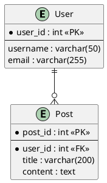
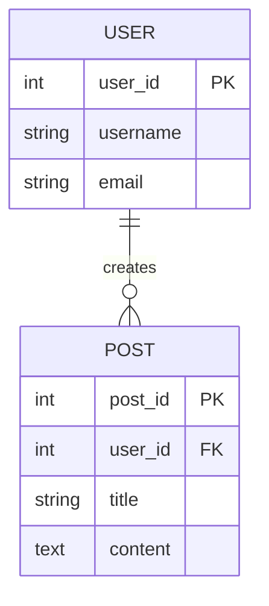

# Database Modeling Tools Comparison

## Overview

Choosing the right database modeling tool depends on your workflow, team size, budget, and technical requirements. This guide compares popular tools across different categories.

---

## Table of Contents

1. [Tool Categories](#tool-categories)
2. [Online/Web-Based Tools](#onlineweb-based-tools)
3. [Desktop Applications](#desktop-applications)
4. [Database-Specific Tools](#database-specific-tools)
5. [Text-Based/Code Tools](#text-basedcode-tools)
6. [Enterprise Tools](#enterprise-tools)
7. [Comparison Matrix](#comparison-matrix)
8. [Recommendations by Use Case](#recommendations-by-use-case)

---

## Tool Categories

### 1. Online/Web-Based
- No installation required
- Collaborative
- Platform-independent
- Usually subscription-based

### 2. Desktop Applications
- Full-featured
- Offline capable
- Better performance for large models
- One-time purchase or free

### 3. Database-Specific
- Tight integration with specific databases
- Reverse engineering
- Direct deployment to database

### 4. Text-Based/Code
- Version control friendly
- Automation capable
- Markdown/text format
- Developer-friendly

### 5. Enterprise
- Team collaboration
- Advanced features
- Expensive
- Training required

---

## Online/Web-Based Tools

### 1. dbdiagram.io

**Website:** https://dbdiagram.io  
**Free Tier:** Yes (limited diagrams)  
**Pricing:** Free / $9/month Pro

**Features:**
- DBML (Database Markup Language) syntax
- Real-time collaboration
- Export to SQL, PNG, PDF
- Simple, clean interface
- Fast and lightweight

**Pros:**
- ✅ Very easy to learn (DBML syntax)
- ✅ Beautiful diagrams
- ✅ Fast diagram creation
- ✅ Share via link
- ✅ Import from SQL

**Cons:**
- ❌ Limited free tier (10 diagrams)
- ❌ No advanced features (triggers, procedures)
- ❌ Simple notation only

**Best For:** Quick prototyping, startups, small teams

**Example:**
```dbml
Table users {
  user_id int [pk, increment]
  username varchar(50) [not null, unique]
  email varchar(255) [not null, unique]
  created_at timestamp [default: `now()`]
}

Table posts {
  post_id int [pk, increment]
  user_id int [ref: > users.user_id]
  title varchar(200)
  content text
}
```

---

### 2. draw.io (diagrams.net)

**Website:** https://app.diagrams.net  
**Free Tier:** Completely free  
**Pricing:** Free (open-source)

**Features:**
- General-purpose diagramming
- ERD, UML, flowcharts, etc.
- Desktop app available
- Integration with Google Drive, OneDrive, GitHub
- Extensive shape libraries

**Pros:**
- ✅ Completely free
- ✅ No account required
- ✅ Very flexible
- ✅ Export to many formats
- ✅ Offline capable
- ✅ Open source

**Cons:**
- ❌ Not database-specific
- ❌ Manual layout
- ❌ No SQL export
- ❌ Steeper learning curve

**Best For:** General diagramming, educational use, budget-conscious teams

---

### 3. Lucidchart

**Website:** https://www.lucidchart.com  
**Free Tier:** Limited (3 documents)  
**Pricing:** $7.95/month Individual / $9/month Team

**Features:**
- Professional diagramming
- Real-time collaboration
- ERD templates
- Import from databases
- Export to SQL
- Integrations (Confluence, Jira, Google Workspace)

**Pros:**
- ✅ Professional appearance
- ✅ Excellent collaboration
- ✅ Large template library
- ✅ Database import/export
- ✅ Easy to use

**Cons:**
- ❌ Expensive for teams
- ❌ Limited free tier
- ❌ Requires internet

**Best For:** Professional teams, enterprise, collaboration-heavy projects

---

### 4. Creately

**Website:** https://creately.com  
**Free Tier:** Limited  
**Pricing:** $5/month Personal / $89/month Team

**Features:**
- Visual collaboration
- ERD templates
- Real-time collaboration
- Database schema design
- Export options

**Pros:**
- ✅ User-friendly interface
- ✅ Good collaboration features
- ✅ Templates available

**Cons:**
- ❌ Limited free features
- ❌ Less database-focused
- ❌ Pricey for teams

**Best For:** Small to medium teams, visual thinkers

---

### 5. QuickDBD

**Website:** https://www.quickdatabasediagrams.com  
**Free Tier:** Yes (limited exports)  
**Pricing:** Free / $14/month Pro

**Features:**
- Text-to-diagram
- Simple syntax
- Export to SQL, image
- Fast prototyping

**Pros:**
- ✅ Very fast for quick diagrams
- ✅ Simple text syntax
- ✅ No drag-and-drop needed
- ✅ Export to SQL

**Cons:**
- ❌ Basic features
- ❌ Limited notation options
- ❌ Paid for exports

**Best For:** Quick prototyping, developers who prefer text

**Example:**
```
users
-
user_id int PK
username varchar(50)
email varchar(255)

posts
-
post_id int PK
user_id int FK >- users.user_id
title varchar(200)
```

---

## Desktop Applications

### 1. MySQL Workbench

**Platform:** Windows, macOS, Linux  
**Free Tier:** Completely free  
**Pricing:** Free

**Features:**
- Database design and modeling
- Reverse engineering from MySQL
- Forward engineering to MySQL
- SQL development
- Database administration
- Visual explain plans

**Pros:**
- ✅ Free and open-source
- ✅ Direct MySQL integration
- ✅ Reverse and forward engineering
- ✅ Full-featured
- ✅ Official MySQL tool

**Cons:**
- ❌ MySQL only
- ❌ Can be slow with large models
- ❌ UI can be clunky

**Best For:** MySQL developers and DBAs, free MySQL modeling

---

### 2. pgModeler

**Platform:** Windows, macOS, Linux  
**Free Tier:** Free trial  
**Pricing:** $15 donation (suggested)

**Features:**
- PostgreSQL-specific modeling
- Reverse engineering
- Export to SQL, PNG, SVG
- Database diff
- Code highlighting

**Pros:**
- ✅ PostgreSQL-specific
- ✅ Affordable
- ✅ Advanced PostgreSQL features
- ✅ Active development

**Cons:**
- ❌ PostgreSQL only
- ❌ Learning curve
- ❌ UI could be better

**Best For:** PostgreSQL developers, advanced PostgreSQL features

---

### 3. DBeaver

**Platform:** Windows, macOS, Linux  
**Free Tier:** Community edition (free)  
**Pricing:** Free / $10/month Enterprise

**Features:**
- Universal database tool
- ER diagrams (limited in free version)
- Supports 100+ databases
- SQL editor
- Data viewer
- Database admin

**Pros:**
- ✅ Free community edition
- ✅ Supports many databases
- ✅ Great SQL editor
- ✅ Active community

**Cons:**
- ❌ ER diagrams limited in free version
- ❌ Not modeling-focused
- ❌ Heavy application

**Best For:** Database developers needing multi-database support

---

### 4. Vertabelo

**Platform:** Web-based  
**Free Tier:** 14-day trial  
**Pricing:** $19/month Professional

**Features:**
- Professional database modeling
- Team collaboration
- Version control
- SQL export for multiple databases
- Database documentation

**Pros:**
- ✅ Professional features
- ✅ Multi-database support
- ✅ Team collaboration
- ✅ Version history

**Cons:**
- ❌ No free tier
- ❌ Web-only
- ❌ Expensive for individuals

**Best For:** Professional teams, multi-database projects

---

## Database-Specific Tools

### SQL Server Management Studio (SSMS)

**Database:** SQL Server  
**Platform:** Windows  
**Pricing:** Free

**Features:**
- Database diagrams
- Reverse engineering
- Direct deployment
- Integrated with SQL Server
- Query tools

**Best For:** SQL Server developers

---

### Oracle SQL Developer Data Modeler

**Database:** Oracle (+ others)  
**Platform:** Windows, macOS, Linux  
**Pricing:** Free

**Features:**
- Logical and physical modeling
- Forward/reverse engineering
- Multi-database support
- Reports

**Best For:** Oracle environments, enterprise

---

### Navicat Data Modeler

**Database:** Multi-database  
**Platform:** Windows, macOS, Linux  
**Pricing:** $99 (one-time)

**Features:**
- Visual database design
- Reverse engineering
- Export SQL
- Supports MySQL, PostgreSQL, SQLite, etc.

**Best For:** Multi-database professionals

---

## Text-Based/Code Tools

### 1. PlantUML

**Platform:** Any (Java-based)  
**Pricing:** Free (open-source)

**Features:**
- Text-to-diagram
- UML, ERD, sequence diagrams
- Integrations (VS Code, IntelliJ)
- Export to PNG, SVG, PDF
- Version control friendly

**Pros:**
- ✅ Free and open-source
- ✅ Version control friendly
- ✅ Automation-friendly
- ✅ Multiple diagram types
- ✅ IDE integration

**Cons:**
- ❌ Learning curve
- ❌ Layout can be tricky
- ❌ Not database-specific

**Best For:** Developers, documentation, CI/CD pipelines

**Example:**


---

### 2. Mermaid

**Platform:** Any (Markdown)  
**Pricing:** Free (open-source)

**Features:**
- Markdown-based diagrams
- GitHub, GitLab, VS Code support
- ER diagrams, class diagrams, flowcharts
- Lightweight

**Pros:**
- ✅ Free and open-source
- ✅ Markdown integration
- ✅ GitHub/GitLab rendering
- ✅ Simple syntax

**Cons:**
- ❌ Limited ER diagram features
- ❌ No SQL export
- ❌ Basic styling

**Best For:** Documentation, GitHub README, lightweight diagrams

**Example:**


---

### 3. DBML (Database Markup Language)

**Platform:** dbdiagram.io, CLI tool  
**Pricing:** Free (open-source)

**Features:**
- Simple text syntax
- Export to SQL
- Convert SQL to DBML
- Documentation generation

**Pros:**
- ✅ Very simple syntax
- ✅ Version control friendly
- ✅ Fast to write

**Cons:**
- ❌ Requires dbdiagram.io for visualization
- ❌ Limited ecosystem

**Best For:** Developers, quick prototyping

---

## Enterprise Tools

### 1. Erwin Data Modeler

**Pricing:** ~$4,000/year  
**Features:**
- Enterprise data modeling
- Forward/reverse engineering
- Metadata management
- Collaboration
- Governance

**Best For:** Large enterprises, data governance teams

---

### 2. IBM InfoSphere Data Architect

**Pricing:** ~$5,000+  
**Features:**
- Enterprise modeling
- Data governance
- Lineage tracking
- Multi-database support

**Best For:** IBM ecosystems, large enterprises

---

### 3. ER/Studio

**Pricing:** ~$3,000/year  
**Features:**
- Data modeling
- Database design
- Collaboration
- Metadata management

**Best For:** Enterprises, regulated industries

---

## Comparison Matrix

| Tool | Free? | Platform | SQL Export | Collab | Best For |
|------|-------|----------|------------|--------|----------|
| **dbdiagram.io** | Limited | Web | ✅ | ✅ | Quick prototyping |
| **draw.io** | ✅ | Web/Desktop | ❌ | Limited | General diagrams |
| **Lucidchart** | Limited | Web | ✅ | ✅ | Professional teams |
| **MySQL Workbench** | ✅ | Desktop | ✅ | ❌ | MySQL developers |
| **pgModeler** | $ | Desktop | ✅ | ❌ | PostgreSQL developers |
| **DBeaver** | ✅ | Desktop | Limited | ❌ | Multi-database devs |
| **PlantUML** | ✅ | Any | ❌ | ✅ | Developers, CI/CD |
| **Mermaid** | ✅ | Any | ❌ | ✅ | Documentation |
| **DBML** | ✅ | Web/CLI | ✅ | ✅ | Developers |
| **Vertabelo** | ❌ | Web | ✅ | ✅ | Professional teams |
| **Erwin** | ❌ | Desktop | ✅ | ✅ | Enterprise |

---

## Recommendations by Use Case

### For Beginners / Students
1. **dbdiagram.io** - Easy to learn, visual
2. **draw.io** - Free, versatile
3. **MySQL Workbench** - Free, professional (if using MySQL)

### For Startups / Small Teams
1. **dbdiagram.io** - Quick, affordable
2. **draw.io** - Free, no vendor lock-in
3. **PlantUML** - Version control, free

### For Professional Developers
1. **MySQL Workbench** or **pgModeler** (database-specific)
2. **PlantUML** - Code-based, automated
3. **Lucidchart** - Professional collaboration

### For Large Teams / Enterprises
1. **Lucidchart** - Collaboration, integrations
2. **Vertabelo** - Professional features
3. **Erwin** or **ER/Studio** - Enterprise governance

### For Documentation / GitHub
1. **Mermaid** - Renders in GitHub
2. **PlantUML** - Versatile, automated
3. **DBML** - Simple, clean

### For Multi-Database Projects
1. **DBeaver** (free)
2. **Vertabelo** (paid)
3. **Navicat Data Modeler**

### For Budget-Conscious
1. **draw.io** - Free
2. **MySQL Workbench** / **pgModeler** - Free/cheap
3. **PlantUML** / **Mermaid** - Free

---

## Feature Comparison

### Features You Might Need

| Feature | Free Tools | Paid Tools |
|---------|-----------|------------|
| **ER Diagrams** | All | All |
| **UML Class Diagrams** | PlantUML, draw.io | Lucidchart, Vertabelo |
| **SQL Export** | dbdiagram.io, PlantUML (via plugins) | All paid tools |
| **Reverse Engineering** | MySQL Workbench, pgModeler | Vertabelo, Erwin |
| **Version Control** | Text-based (PlantUML, DBML, Mermaid) | Some (Vertabelo) |
| **Collaboration** | dbdiagram.io (limited), GitHub (text-based) | Lucidchart, Vertabelo |
| **Multi-Database** | DBeaver | Vertabelo, Erwin |
| **Database Admin** | MySQL Workbench, DBeaver | SSMS, SQL Developer |

---

## Summary & Quick Picks

**I want to...**

- **...learn database modeling:** → dbdiagram.io or draw.io
- **...create quick diagrams:** → dbdiagram.io or QuickDBD
- **...work with MySQL:** → MySQL Workbench
- **...work with PostgreSQL:** → pgModeler
- **...collaborate with my team:** → Lucidchart or Vertabelo
- **...use version control:** → PlantUML, Mermaid, or DBML
- **...include diagrams in GitHub README:** → Mermaid
- **...not pay anything:** → draw.io, MySQL Workbench, PlantUML, Mermaid
- **...professional features on a budget:** → Vertabelo ($19/month)
- **...enterprise governance:** → Erwin or ER/Studio

---

## Conclusion

No single tool is perfect for all scenarios. Consider:

1. **Your database:** MySQL Workbench, pgModeler, or multi-database
2. **Your budget:** Free (draw.io, text-based) or paid (Lucidchart, Vertabelo)
3. **Your workflow:** Visual (GUI) or text-based (code)
4. **Your team size:** Solo (any), small (dbdiagram.io), large (Lucidchart, Vertabelo)
5. **Your needs:** Quick diagrams, production systems, or documentation

**My Personal Recommendations:**

- **Quick prototyping:** dbdiagram.io
- **Free & professional:** MySQL Workbench (MySQL) or pgModeler (PostgreSQL)
- **Documentation:** Mermaid (GitHub) or PlantUML (complex diagrams)
- **Team collaboration:** Lucidchart
- **Budget-conscious:** draw.io

Try a few tools and find what works best for your workflow!

---

## References

- dbdiagram.io: https://dbdiagram.io
- draw.io: https://www.diagrams.net
- Lucidchart: https://www.lucidchart.com
- MySQL Workbench: https://www.mysql.com/products/workbench/
- pgModeler: https://pgmodeler.io
- DBeaver: https://dbeaver.io
- PlantUML: https://plantuml.com
- Mermaid: https://mermaid.js.org
- DBML: https://www.dbml.org
