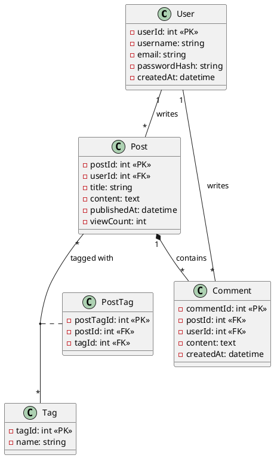
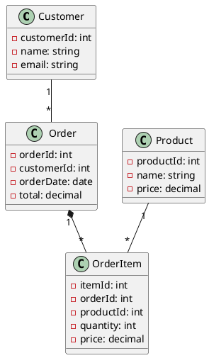
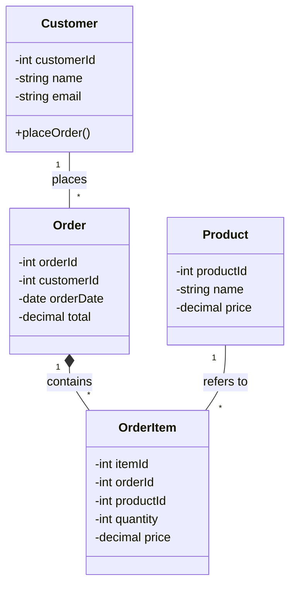

# UML Class Diagrams for Database Modeling

## Overview

While UML Class Diagrams are primarily used in object-oriented design, they are also valuable for database modeling. They show classes (which map to tables), attributes (columns), and relationships with clear multiplicity indicators.

---

## Table of Contents

1. [UML Basics for Databases](#uml-basics-for-databases)
2. [Class Diagram Elements](#class-diagram-elements)
3. [Relationships and Multiplicities](#relationships-and-multiplicities)
4. [Simple Examples](#simple-examples)
5. [Advanced Patterns](#advanced-patterns)
6. [ORM Mapping](#orm-mapping)
7. [Tools and Syntax](#tools-and-syntax)

---

## UML Basics for Databases

### Mapping Concepts

| Database | UML |
|----------|-----|
| Table | Class |
| Column | Attribute |
| Foreign Key | Association |
| Primary Key | Identifier/Attribute |
| Many-to-Many | Association Class |

### Why Use UML for Databases?

✅ **Benefits:**
- Familiar to developers (especially OOP developers)
- Clear multiplicity notation
- Good for ORM mapping (Hibernate, Entity Framework)
- Supports inheritance and composition
- Industry standard

❌ **Limitations:**
- Less database-specific than ERDs
- May overcomplicate simple schemas
- Not ideal for DBAs who prefer traditional ERDs

---

## Class Diagram Elements

### Class Notation

```
┌─────────────────────┐
│      Customer       │ <- Class Name (Table Name)
├─────────────────────┤
│ - customerId: int   │ <- Attributes (Columns)
│ - name: string      │
│ - email: string     │
│ - createdAt: date   │
├─────────────────────┤
│ + placeOrder()      │ <- Operations (optional for databases)
│ + updateProfile()   │
└─────────────────────┘
```

### Visibility Modifiers

- `+` Public (accessible)
- `-` Private (internal)
- `#` Protected
- `~` Package

**For Database Modeling:** Usually use `+` or `-`, or omit entirely.

### Data Types

Common UML data types for databases:

```
┌─────────────────────┐
│       User          │
├─────────────────────┤
│ - userId: int       │
│ - username: string  │
│ - email: string     │
│ - balance: decimal  │
│ - isActive: boolean │
│ - createdAt: datetime │
│ - metadata: json    │
└─────────────────────┘
```

### Stereotypes

Use stereotypes to indicate special types:

```
┌─────────────────────┐
│    <<table>>        │
│      Customer       │
├─────────────────────┤
│ <<PK>> customerId   │
│ name                │
│ email               │
└─────────────────────┘

┌─────────────────────┐
│  <<view>>           │
│  ActiveCustomers    │
├─────────────────────┤
│ customerId          │
│ name                │
│ orderCount          │
└─────────────────────┘
```

---

## Relationships and Multiplicities

### Association (Relationship)

Basic relationship between classes.

```
┌──────────┐                    ┌──────────┐
│ Customer │────────────────────│  Order   │
└──────────┘      places        └──────────┘
```

### Multiplicity Notation

```
1       Exactly one
0..1    Zero or one
*       Zero or more
1..*    One or more
n..m    Between n and m
```

### One-to-One

```
┌──────────┐                    ┌──────────────┐
│   User   │ 1 ──────────── 1  │ UserProfile  │
└──────────┘                    └──────────────┘
```

### One-to-Many

```
┌────────────┐                  ┌──────────┐
│ Department │ 1 ───────────* │ Employee │
└────────────┘   employs       └──────────┘

One department has many employees
```

### Many-to-Many

```
┌─────────┐               ┌──────────────┐              ┌─────────┐
│ Student │ * ───────────│ Enrollment   │───────────* │ Course  │
└─────────┘               ├──────────────┤              └─────────┘
                          │ enrollmentId │
                          │ semester     │
                          │ grade        │
                          └──────────────┘

Association Class (junction table) for many-to-many
```

### Directed Association (Navigation)

Arrow indicates navigation direction (foreign key location).

```
┌──────────┐                    ┌──────────┐
│  Order   │ ──────────────────>│ Customer │
└──────────┘                    └──────────┘
         knows

Order table has customerId foreign key
```

### Aggregation (Shared Ownership)

Hollow diamond - "has-a" relationship, can exist independently.

```
┌────────────┐                  ┌──────────┐
│ Department │◇───────────────* │ Employee │
└────────────┘                  └──────────┘

Department has employees, but employees can exist without department
```

### Composition (Strong Ownership)

Filled diamond - strong "owns" relationship, dependent lifecycle.

```
┌─────────┐                     ┌────────────┐
│  Order  │◆──────────────────* │ OrderItem  │
└─────────┘                     └────────────┘

Order owns order items - deleting order deletes items (CASCADE)
```

---

## Simple Examples

### Example 1: Blog System



**Text Representation:**

```
┌─────────────────────┐
│        User         │
├─────────────────────┤
│ - userId: int       │
│ - username: string  │
│ - email: string     │
│ - passwordHash: str │
│ - createdAt: date   │
└─────────────────────┘
         │
         │ writes
         │ 1
         │
         │*
┌─────────────────────┐
│        Post         │
├─────────────────────┤*───────────────────┐
│ - postId: int       │                    │
│ - userId: int       │                    │ tagged with
│ - title: string     │                    │
│ - content: text     │                    │
│ - publishedAt: date │         ┌──────────────────┐
│ - viewCount: int    │         │ PostTag          │
└─────────────────────┘       * ├──────────────────┤*
         │◆                     │ postTagId: int   │
         │                      │ postId: int      │
         │                      │ tagId: int       │
         │ contains             └──────────────────┘
         │ 1                              │
         │                                │
         │*                               │
┌─────────────────────┐                  │*
│      Comment        │         ┌──────────────────┐
├─────────────────────┤         │       Tag        │
│ - commentId: int    │         ├──────────────────┤
│ - postId: int       │         │ - tagId: int     │
│ - userId: int       │         │ - name: string   │
│ - content: text     │         └──────────────────┘
│ - createdAt: date   │
└─────────────────────┘
```

### Example 2: E-commerce

```
┌─────────────────────┐
│      Customer       │
├─────────────────────┤
│ - customerId: int   │
│ - name: string      │
│ - email: string     │
│ - phone: string     │
└─────────────────────┘
         │
         │ places
         │ 1
         │
         │*
┌─────────────────────┐
│       Order         │
├─────────────────────┤
│ - orderId: int      │
│ - customerId: int   │
│ - orderDate: date   │
│ - total: decimal    │
│ - status: string    │
└─────────────────────┘
         │◆
         │ contains
         │ 1
         │
         │*
┌─────────────────────┐
│     OrderItem       │
├─────────────────────┤
│ - itemId: int       │
│ - orderId: int      │
│ - productId: int    │
│ - quantity: int     │
│ - price: decimal    │
└─────────────────────┘
         │
         │ refers to
         │*
         │
         │ 1
┌─────────────────────┐
│      Product        │
├─────────────────────┤
│ - productId: int    │
│ - name: string      │
│ - description: text │
│ - price: decimal    │
│ - stock: int        │
│ - categoryId: int   │
└─────────────────────┘
         │
         │ belongs to
         │*
         │
         │ 1
┌─────────────────────┐
│      Category       │
├─────────────────────┤
│ - categoryId: int   │
│ - name: string      │
│ - parentId: int     │ (self-reference)
└─────────────────────┘
```

---

## Advanced Patterns

### Inheritance (Generalization)

Represent table inheritance strategies.

#### Single Table Inheritance

```
┌─────────────────────┐
│      Person         │
├─────────────────────┤
│ - personId: int     │
│ - type: string      │ (discriminator: 'customer' or 'employee')
│ - name: string      │
│ - email: string     │
│ - salary: decimal   │ (for employees, NULL for customers)
│ - points: int       │ (for customers, NULL for employees)
└─────────────────────┘
         △
         │
    ┌────┴────┐
    │         │
┌─────────┐ ┌──────────┐
│Customer │ │ Employee │
└─────────┘ └──────────┘

Single table with type discriminator
```

#### Class Table Inheritance

```
┌─────────────────────┐
│      Person         │
├─────────────────────┤
│ - personId: int     │
│ - name: string      │
│ - email: string     │
└─────────────────────┘
         △
         │
    ┌────┴────┐
    │         │
┌─────────────────┐ ┌───────────────────┐
│    Customer     │ │     Employee      │
├─────────────────┤ ├───────────────────┤
│ - customerId:int│ │ - employeeId: int │
│ - points: int   │ │ - salary: decimal │
│ - tier: string  │ │ - department: str │
└─────────────────┘ └───────────────────┘

Separate tables joined by foreign key
```

### Recursive Association (Self-Reference)

```
┌─────────────────────┐
│      Employee       │
├─────────────────────┤
│ - employeeId: int   │
│ - name: string      │
│ - managerId: int    │──┐
└─────────────────────┘  │
         │               │
         │ reports to    │
         └───────────────┘

Employee can manage other employees
```

```
┌─────────────────────┐
│      Category       │
├─────────────────────┤
│ - categoryId: int   │
│ - name: string      │
│ - parentId: int     │──┐
└─────────────────────┘  │
         │               │
         │ parent        │
         └───────────────┘

Category hierarchy (tree structure)
```

### Ternary Association

Three-way relationship (rare, usually decomposed).

```
         ┌──────────┐
         │ Project  │
         └─────┬────┘
               │
         ┌─────┴─────┐
         │           │
   ┌─────┴──┐   ┌───┴──────┐
   │Employee│   │   Role   │
   └────────┘   └──────────┘
         │           │
         └─────┬─────┘
               │
      ┌────────┴─────────┐
      │ ProjectAssignment│
      ├──────────────────┤
      │ employeeId: int  │
      │ projectId: int   │
      │ roleId: int      │
      └──────────────────┘

Employee works on Project in a specific Role
```

---

## ORM Mapping

### Mapping to Object-Relational Models

UML classes map naturally to ORM entities.

**Java (JPA/Hibernate):**

```java
@Entity
@Table(name = "customers")
public class Customer {
    @Id
    @GeneratedValue(strategy = GenerationType.IDENTITY)
    @Column(name = "customer_id")
    private Integer customerId;
    
    @Column(name = "name", nullable = false, length = 100)
    private String name;
    
    @Column(name = "email", unique = true)
    private String email;
    
    @OneToMany(mappedBy = "customer", cascade = CascadeType.ALL)
    private List<Order> orders;
}

@Entity
@Table(name = "orders")
public class Order {
    @Id
    @GeneratedValue(strategy = GenerationType.IDENTITY)
    @Column(name = "order_id")
    private Integer orderId;
    
    @ManyToOne
    @JoinColumn(name = "customer_id", nullable = false)
    private Customer customer;
    
    @Column(name = "order_date")
    private LocalDate orderDate;
    
    @Column(name = "total", precision = 10, scale = 2)
    private BigDecimal total;
}
```

**Python (SQLAlchemy):**

```python
from sqlalchemy import Column, Integer, String, ForeignKey, DECIMAL, Date
from sqlalchemy.orm import relationship

class Customer(Base):
    __tablename__ = 'customers'
    
    customer_id = Column(Integer, primary_key=True)
    name = Column(String(100), nullable=False)
    email = Column(String(255), unique=True)
    
    # Relationship
    orders = relationship('Order', back_populates='customer')

class Order(Base):
    __tablename__ = 'orders'
    
    order_id = Column(Integer, primary_key=True)
    customer_id = Column(Integer, ForeignKey('customers.customer_id'))
    order_date = Column(Date)
    total = Column(DECIMAL(10, 2))
    
    # Relationship
    customer = relationship('Customer', back_populates='orders')
```

**C# (Entity Framework):**

```csharp
public class Customer
{
    [Key]
    public int CustomerId { get; set; }
    
    [Required]
    [MaxLength(100)]
    public string Name { get; set; }
    
    [EmailAddress]
    public string Email { get; set; }
    
    // Navigation property
    public ICollection<Order> Orders { get; set; }
}

public class Order
{
    [Key]
    public int OrderId { get; set; }
    
    [Required]
    public int CustomerId { get; set; }
    
    public DateTime OrderDate { get; set; }
    
    [Column(TypeName = "decimal(10, 2)")]
    public decimal Total { get; set; }
    
    // Navigation property
    public Customer Customer { get; set; }
}
```

---

## Tools and Syntax

### PlantUML

Text-based UML diagrams.



### Mermaid

Markdown-compatible UML diagrams.



### Visual Tools

1. **Visual Paradigm** - Professional UML tool
2. **StarUML** - Open-source UML modeler
3. **draw.io** - Free, web-based
4. **Lucidchart** - Collaborative diagramming
5. **PlantUML** - Text-to-diagram
6. **Mermaid** - Markdown-based
7. **ArgoUML** - Open-source UML tool

---

## Best Practices

### For Database Modeling with UML

✅ **Do:**
- Use composition (◆) for CASCADE delete relationships
- Use aggregation (◇) for independent entities
- Show multiplicity on both ends of associations
- Include primary keys and foreign keys
- Use stereotypes (<<table>>, <<view>>, <<PK>>, <<FK>>)
- Keep class names singular
- Align with ORM conventions if using ORM

❌ **Don't:**
- Overcomplicate with too many operations (methods)
- Mix conceptual and physical models
- Forget to show junction tables for many-to-many
- Use UML features not supported by databases
- Ignore database constraints in favor of OOP purity

### Design Workflow

1. **Conceptual Model:** High-level classes and relationships
2. **Logical Model:** Add attributes, refine relationships
3. **Physical Model:** Add data types, constraints, indexes
4. **Generate SQL:** Create DDL from diagram
5. **Generate Code:** Generate ORM entity classes

---

## Summary

UML Class Diagrams are excellent for:
- **OOP Developers:** Familiar notation
- **ORM Mapping:** Direct translation to code
- **Domain Modeling:** Business objects as classes
- **Communication:** Bridge between dev and database teams

Choose UML over ERD when:
- Using ORM frameworks (Hibernate, Entity Framework, etc.)
- Team is more familiar with OOP
- Need to model inheritance hierarchies
- Want to generate both code and SQL

Combine with ERD when:
- Need database-specific details
- Working with DBAs
- Documenting existing databases

---

## References

- "UML Distilled" by Martin Fowler
- "Domain-Driven Design" by Eric Evans
- "JPA & Hibernate" documentation
- PlantUML documentation: https://plantuml.com/class-diagram
- Mermaid documentation: https://mermaid.js.org/syntax/classDiagram.html
